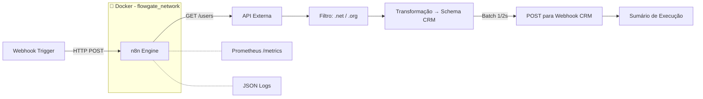

# 🚀 Flowgate Automation

> Pipeline ETL de nível produção para sincronização resiliente de dados de usuários.
> Construído com n8n + Docker. Battle-tested com retry, batching e observabilidade.

<p align="center">
  
  
  
  
  
</p>

---

## 📋 Índice

1. [O Problema](#-o-problema)
2. [A Solução](#-a-solução)
3. [Arquitetura](#-arquitetura)
4. [Stack Tecnológica](#-stack-tecnológica)
5. [Funcionalidades](#-funcionalidades)
6. [Início Rápido](#-início-rápido)
7. [Como Usar](#-como-usar)
8. [Observabilidade](#-observabilidade)
9. [Segurança](#-segurança)
10. [Lições Aprendidas](#-lições-aprendidas)
11. [Roadmap](#-roadmap)
12. [Autor](#-autor)

---

## 🤔 O Problema

Sistemas legados de CRM perdem horas de trabalho manual de integração sempre que
precisam sincronizar dados de usuários de uma API externa. O endpoint tem
**rate limits agressivos**, exige **transformação de schema** e **falhas parciais
não podem derrubar o pipeline inteiro**.

Equipes geralmente:
- Rodam cron jobs frágeis sem lógica de retry
- Exportam/importam CSVs manualmente
- Escrevem scripts pontuais que quebram quando a API muda

## ✅ A Solução

O **Flowgate Automation** é um pipeline ETL conteinerizado que:

- 🔄 **Extrai** usuários de APIs externas
- 🔍 **Filtra** registros por regras de negócio (domínio de email)
- 🔧 **Transforma** os dados para o schema do CRM de destino
- 📤 **Envia** com batching + retry para respeitar rate limits
- 📊 **Reporta** métricas de execução via Prometheus e logs estruturados

> Zero dependências externas. Um `docker compose up`. Pronto em menos de 40 segundos.

---

## 🏗 Arquitetura



### Pipeline (n8n) — 6 Nós, 3 Estratégias de Resiliência

| Etapa | Nó | Resiliência |
|-------|-----|------------|
| 1 | **Webhook** (Trigger) | — |
| 2 | **GET /users** | 🔁 5 tentativas, backoff de 5s |
| 3 | **Filtrar por domínio** | Lógica pura, sem falhas |
| 4 | **Transformar para schema** | Acesso seguro a campos |
| 5 | **POST para CRM** | 🔁 5 tentativas, ⏱️ batching 1req/2s, ⚠️ `onError: continue` |
| 6 | **Resposta** | Correlation ID para rastreabilidade |

> **Arquitetura completa**: [`docs/architecture.md`](docs/architecture.md)  
> **Decisões de design**: [`docs/decisions/`](docs/decisions/)

---

## 🧰 Stack Tecnológica

| Camada | Tecnologia | Versão |
|-------|-----------|---------|
| **Orquestração** | [n8n](https://n8n.io) | `1.94.1` (fixa) |
| **Containerização** | Docker + Docker Compose | `26+` |
| **CI/CD** | GitHub Actions | — |
| **Observabilidade** | Prometheus `/metrics` | — |
| **Scripts** | Bash | — |
| **Git Hooks** | Husky + Commitlint | `9.x` / `19.x` |

---

## ⚡ Funcionalidades

- ✅ **ETL conteinerizado**: Extrai, filtra, transforma e carrega dados automaticamente
- ✅ **Resiliência em 3 camadas**: Retry (5x), batching (1 req / 2s), tolerância a falhas parciais
- ✅ **Healthcheck**: Docker verifica se o n8n está saudável antes de marcar como pronto
- ✅ **Limites de recursos**: CPU e memória configurados no compose (produção vs dev)
- ✅ **Observabilidade nativa**: Endpoint Prometheus `/metrics` + logs JSON
- ✅ **IaC versionada**: Infraestrutura como código com rede bridge isolada e volume persistente
- ✅ **CI Quality Gate**: Validação automática do workflow JSON e do docker-compose
- ✅ **Seguro**: Imagem com versão fixa, secrets no `.env`, non-root container
- ✅ **Portátil**: Um `docker compose up` a partir do zero

---

## ⚡ Início Rápido

### Pré-requisitos

- [Docker](https://docs.docker.com/get-docker/) v26+

### 3 Comandos para Rodar

```bash
# 1. Clonar
git clone https://github.com/lucasdaniel2201/flowgate-automation.git
cd flowgate-automation

# 2. Configurar
cp .env.example .env
# Edite o .env com suas credenciais (senha, URL do webhook)

# 3. Iniciar
make up
```

O n8n estará disponível em **http://localhost:5678**  
Métricas em **http://localhost:5678/metrics**

### Importar o Workflow

```bash
make n8n-import
# ou manualmente: n8n UI → Importar do Arquivo → workflows/workflow_boavista.json
```

### Comandos do Makefile

```bash
make up          # Sobe o n8n com healthcheck
make down        # Para os serviços
make logs        # Segue os logs
make ps          # Lista containers
make shell       # Abre terminal no container
make n8n-import  # Importa o workflow
```

---

## 📖 Como Usar

### Via Webhook

```bash
# Dispara o pipeline
curl -X POST http://localhost:5678/webhook/iniciar

# Resposta
{
  "executionTime": "2026-06-22T15:30:00.000Z",
  "message": "Workflow executado com sucesso",
  "totalItemsProcessed": 4,
  "correlationId": "abc-123-def"
}
```

### Fluxo do Pipeline

1. **Webhook** recebe o gatilho
2. **GET** na API externa (`USERS_API_URL`) — 5 tentativas com 5s de backoff
3. **Filtro** por domínio de email (`.net` e `.org`)
4. **Transformação** para o schema do CRM
5. **POST** um a um com batching (1 req / 2s) — falhas parciais não interrompem
6. **Resposta** com sumário + correlation ID

---

## 📊 Observabilidade

### Métricas Prometheus

```
GET http://localhost:5678/metrics
```

| Métrica | Descrição |
|--------|-----------|
| `n8n_workflow_executions_total` | Total de execuções (sucesso + falha) |
| `n8n_workflow_executions_succeeded_total` | Execuções bem-sucedidas |
| `n8n_http_request_duration_seconds` | Histograma de latência HTTP |
| `n8n_active_workflows` | Pipelines ativos |

### Logs Estruturados (JSON)

Cada linha de log é parseável sem regex frágil:

```json
{
  "level": "info",
  "name": "n8n",
  "msg": "Workflow execution started",
  "workflowId": "abc123",
  "executionId": "456"
}
```

> **Guia completo**: [`docs/observability.md`](docs/observability.md)

---

## 🔒 Segurança

- **Versões fixas**: Sem `:latest` — imagem Docker fixada em `1.94.1`
- **Secrets no `.env`**: Nunca commitados. JSON Schema valida a estrutura
- **Usuário non-root**: Container sem privilégios
- **Rede isolada**: Bridge network dedicada (`flowgate_network`)
- **Dependabot**: Atualizações semanais para Docker e GitHub Actions

> **Política completa**: [`SECURITY.md`](SECURITY.md)

---

## 📚 Lições Aprendidas

### 1. Batching + Retry > Só Retry
Só retry estava martelando o endpoint. Adicionar batching (1 req / 2s) resolveu
HTTP 429 permanentemente. **A lição: entenda o modo de falha antes de aplicar a correção.**

### 2. Healthcheck no Docker Evita Corridas
Sem healthcheck, o `start.sh` não sabe quando o n8n está realmente pronto — o container
sobe, mas a API ainda está carregando. O healthcheck HTTP elimina esse race condition.

### 3. Versão Fixa de Imagem é Segurança Básica
`:latest` é um risco silencioso: uma atualização quebra seu pipeline e você não sabe
por quê. Fixar a versão (`1.94.1`) é o mínimo para um ambiente previsível.

### 4. ADRs São Aceleradores de Carreira
Documentar *por que* escolhi n8n em vez de Airflow (não só *o que* usei) mostra que
penso em trade-offs arquiteturais. É o tipo de coisa que separa pleno de sênior.

> Leia os ADRs completos: [`docs/decisions/`](docs/decisions/)

---

## 🗺 Roadmap

- [x] Pipeline n8n com 6 nós e 3 camadas de resiliência
- [x] Docker compose com healthcheck, limites de recursos e rede isolada
- [x] CI/CD validando workflow e infraestrutura automaticamente
- [x] ADRs documentando decisões de arquitetura
- [ ] Helm chart para deploy em Kubernetes
- [ ] Microserviço Node para processamento de regras de negócio
- [ ] Terraform para provisionar infraestrutura cloud (EKS + RDS)
- [ ] SQS Dead Letter Queue para registros com falha
- [ ] Integração SSO (Keycloak/OIDC)

---

## 👤 Autor

**Lucas Daniel** — SRE / Platform Engineer

- 🐙 GitHub: [@lucasdaniel2201](https://github.com/lucasdaniel2201)
- 💼 LinkedIn: [linkedin.com/in/seu-perfil](https://linkedin.com/in/seu-perfil)

---

## 📄 Licença

MIT — veja [`LICENSE`](LICENSE) para detalhes.

---

<p align="center">
  <sub>Feito com ❤️ e compromisso com infraestrutura sólida. Se ajudou, dê uma ⭐!</sub>
</p>
