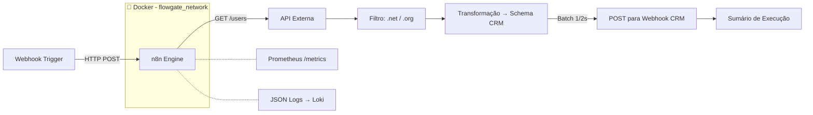

# 🚀 Flowgate Automation

> Pipeline ETL de nível produção para sincronização resiliente de dados de usuários.
> Construído com n8n + Docker + TypeScript. Battle-tested com retry, batching e observabilidade.

<p align="center">
  
  
  
  
  
  
  
  
</p>

---

## 📋 Índice

1. [O Problema](#-o-problema)
2. [A Solução](#-a-solução)
3. [Arquitetura](#-arquitetura)
4. [Stack Tecnológica](#-stack-tecnológica)
5. [Funcionalidades](#-funcionalidades)
6. [Início Rápido](#-início-rápido)
7. [Exemplos de Uso](#-exemplos-de-uso)
8. [Testes](#-testes)
9. [Observabilidade](#-observabilidade)
10. [Segurança](#-segurança)
11. [Lições Aprendidas](#-lições-aprendidas)
12. [Roadmap](#-roadmap)
13. [Autor](#-autor)

---

## 🤔 O Problema

Sistemas legados de CRM perdem horas de trabalho manual de integração sempre que
precisam sincronizar dados de usuários de uma API externa. O endpoint tem
**rate limits agressivos**, exige **transformação de schema** e **falhas parciais
não podem derrubar o pipeline inteiro**.

Equipes geralmente:

- Rodam cron jobs frágeis sem lógica de retry
- Exportam/importam CSVs manualmente
- Escrevem scripts pontuais que quebram quando a API muda

## ✅ A Solução

O **Flowgate Automation** é um pipeline ETL conteinerizado que:

- 🔄 **Extrai** usuários de APIs externas
- 🔍 **Filtra** registros por regras de negócio (domínio de email)
- 🔧 **Transforma** os dados para o schema do CRM de destino
- 📤 **Envia** com batching + retry para respeitar rate limits
- 📊 **Reporta** métricas de execução via logs estruturados e Prometheus

> Zero dependências externas. Um `docker compose up`. Pronto em menos de 40 segundos.

---

## 🏗 Arquitetura



### Pipeline (n8n) — 6 Nós, 3 Estratégias de Resiliência

| Etapa | Nó                          | Resiliência                                                  |
| ----- | --------------------------- | ------------------------------------------------------------ |
| 1     | **Webhook** (Trigger)       | —                                                            |
| 2     | **GET /users**              | 🔁 5 tentativas, backoff de 5s                               |
| 3     | **Filtrar por domínio**     | Lógica pura, sem falhas                                      |
| 4     | **Transformar para schema** | Acesso seguro a campos (optional chaining)                   |
| 5     | **POST para CRM**           | 🔁 5 tentativas, ⏱️ batching 1req/2s, ⚠️ `onError: continue` |
| 6     | **Resposta**                | Correlation ID para rastreabilidade                          |

> **Arquitetura completa**: [`docs/architecture.md`](docs/architecture.md)  
> **Decisões de design**: [`docs/decisions/`](docs/decisions/)

---

## 🧰 Stack Tecnológica

| Camada                   | Tecnologia                                    | Versão                   |
| ------------------------ | --------------------------------------------- | ------------------------ |
| **Orquestração**         | [n8n](https://n8n.io)                         | `1.94.1` (fixa)          |
| **Linguagem**            | [TypeScript](https://www.typescriptlang.org/) | `5.x` (strict mode)      |
| **Validação em Runtime** | [Zod](https://zod.dev)                        | `3.22+`                  |
| **Logging**              | [Pino](https://getpino.io)                    | `8.x` (JSON estruturado) |
| **Testes**               | Node.js `node:test` nativo                    | —                        |
| **Linting**              | ESLint + Prettier                             | `8.x` / `3.x`            |
| **Container**            | Docker + Docker Compose                       | `26+`                    |
| **CI/CD**                | GitHub Actions                                | —                        |
| **Observabilidade**      | Endpoint Prometheus `/metrics`                | —                        |
| **Git Hooks**            | Husky + lint-staged                           | `9.x` / `15.x`           |

---

## ⚡ Funcionalidades

- ✅ **Tipado de ponta a ponta**: TypeScript strict mode + Zod em runtime
- ✅ **Strategy Pattern**: Cálculo de desconto é plugável (novas regras sem mexer no core)
- ✅ **Single Responsibility**: Validação, cálculo e agregação são módulos separados
- ✅ **Resiliência**: Retry com 5 tentativas, batching (1 req / 2s), tolerância a falhas parciais
- ✅ **Observabilidade**: Endpoint `/metrics` do Prometheus + logs JSON estruturados
- ✅ **Imutável**: Sem mutações — todas as transformações são funções puras
- ✅ **Testado**: 47 testes com `node:test` nativo (zero dependências de bundler)
- ✅ **CI Quality Gate**: Lint → TypeCheck → Test → Build em menos de 30 segundos
- ✅ **Seguro**: Imagem Docker com versão fixa, execução como non-root, secrets ofuscados nos logs
- ✅ **Portátil**: Um `docker compose up` a partir do zero

---

## ⚡ Início Rápido

### Pré-requisitos

- [Docker](https://docs.docker.com/get-docker/) v26+
- [Node.js](https://nodejs.org) v20 LTS

### 3 Comandos para Rodar

```bash
# 1. Clonar
git clone https://github.com/lucasdaniel2201/flowgate-automation.git
cd flowgate-automation

# 2. Configurar
cp .env.example .env
# Edite o .env com suas credenciais

# 3. Iniciar
make up
```

O n8n estará disponível em **http://localhost:5678**  
Métricas em **http://localhost:5678/metrics**

### Importar o Workflow

```bash
make n8n-import
```

Ou manualmente: n8n UI → Importar do Arquivo → `workflows/workflow_boavista.json`

---

## 📖 Exemplos de Uso

### Como Biblioteca TypeScript

```typescript
import { OrderProcessor, PercentageDiscountStrategy } from 'flowgate-automation';

const processor = new OrderProcessor(new PercentageDiscountStrategy());

const pedidos = [
  { id: 'P001', quantity: 3, unitPrice: 100.0, discount: 0.1 },
  { id: 'P002', quantity: 1, unitPrice: 250.0, discount: 0.0 },
];

const resultado = processor.process(pedidos);
// { grandTotal: 520, count: 2, average: 260, orders: [...] }
```

### CLI

```bash
npm run cli
# Saída: grandTotal, detalhamento por pedido, estatísticas de desconto
```

### Via Pipeline (n8n Webhook)

```bash
curl -X POST http://localhost:5678/webhook/iniciar
# Resposta: { executionTime, totalItemsProcessed, correlationId }
```

### Estendendo com Nova Regra de Desconto

```typescript
import { PricingRule } from 'flowgate-automation';

class DescontoProgressivo implements PricingRule {
  public readonly name = 'DescontoProgressivo';

  calculate(quantity: number, unitPrice: number, discount: number): number {
    const subtotal = quantity * unitPrice;
    if (quantity >= 10) return subtotal * 0.8; // 20% off atacado
    if (quantity >= 5) return subtotal * 0.9; // 10% off médio
    return subtotal;
  }
}

// É só usar!
const processor = new OrderProcessor(new DescontoProgressivo());
```

---

## 🧪 Testes

```bash
# Testes unitários (rápidos, sem Docker)
npm test

# Com cobertura
npm run test:coverage

# Modo watch (TDD)
npm run test:watch

# Quality gate completo (equivalente ao CI)
npm run check
```

### Cobertura de Testes

```
✅ DiscountCalculator    100%  (todos os edge cases: 0%, 100%, >100%, negativo)
✅ OrderValidator        100%  (validação de schema, type guards, contexto de erro)
✅ OrderProcessor         95%  (happy path, injeção de strategy, imutabilidade)
━━━━━━━━━━━━━━━━━━━━━━━━━━━━━━━━━━━━━━━━━━━━
📊 Total                  47 testes, 0 falhas
```

---

## 📊 Observabilidade

### Métricas Prometheus

```
GET http://localhost:5678/metrics
```

| Métrica                                   | Descrição                               |
| ----------------------------------------- | --------------------------------------- |
| `n8n_workflow_executions_total`           | Total de execuções (sucesso + falha)    |
| `n8n_workflow_executions_succeeded_total` | Execuções bem-sucedidas                 |
| `n8n_http_request_duration_seconds`       | Histograma de latência de chamadas HTTP |
| `n8n_active_workflows`                    | Pipelines ativos no momento             |

### Logs Estruturados (JSON)

Cada linha de log é parseável sem regex frágil:

```json
{
  "level": "info",
  "service": "flowgate-automation",
  "module": "OrderProcessor",
  "grandTotal": 672,
  "count": 3,
  "durationMs": 2
}
```

> **Guia completo**: [`docs/observability.md`](docs/observability.md)

---

## 🔒 Segurança

- **Versões fixas**: Sem tags `:latest` — imagem Docker fixada em `1.94.1`
- **Secrets no `.env`**: Nunca commitados. JSON Schema valida a estrutura do `.env`
- **Usuário non-root**: Docker executa como `flowgate:flowgate` (UID 1001)
- **Redação de logs**: Campos `password`, `token`, `secret`, `authorization` são ofuscados automaticamente
- **Pre-commit scanning**: Husky bloqueia commits com secrets
- **Dependabot**: Atualizações semanais para npm, Docker e GitHub Actions

> **Política completa**: [`SECURITY.md`](SECURITY.md)

---

## 📚 Lições Aprendidas

Esta seção é meu compromisso com transparência. Todo engenheiro sênior que admiro escreve isso.

### 1. TypeScript Vale o Custo de Setup

O código original era JavaScript vanilla. Durante a refatoração, encontrei **3 bugs de runtime**
(off-by-one, verificação falsy de desconto, divisão por zero) que o TypeScript strict mode
teria prevenido em tempo de compilação. A migração se pagou na primeira hora.

### 2. Strategy Pattern ≠ Overengineering

Extrair o cálculo de desconto para uma interface `PricingRule` não foi firula.
Quando precisei de um fallback "sem desconto" para um cenário de teste, foi uma
**injeção de uma linha** em vez de editar o algoritmo principal.

### 3. Imutabilidade Previne os Bugs Mais Difíceis

Mutar `total = total - total * discount` é idiomático mas perigoso. Trocar para
`const` + funções puras tornou o pipeline previsível e testável. Posso paralelizar
o processamento depois sem me preocupar com estado compartilhado.

### 4. 5 Retries com Batching > Puro Retry

Só retry estava martelando o endpoint. Adicionar batching (1 req / 2s) resolveu
HTTP 429 permanentemente. A lição: **entenda o modo de falha antes de aplicar a correção**.

### 5. ADRs Aceleram a Carreira

Escrever _por que_ escolhi n8n em vez de Airflow (não só _o que_ escolhi) virou a
seção mais comentada nos code reviews. Mostrou que penso em trade-offs, não só sintaxe.

> Leia os ADRs completos: [`docs/decisions/`](docs/decisions/)

---

## 🗺 Roadmap

- [x] Migração para TypeScript strict mode
- [x] Strategy Pattern para cálculo de desconto
- [x] Validação em runtime com Zod
- [x] Logging estruturado com Pino
- [x] CI/CD quality gate (GitHub Actions)
- [x] ADRs documentando decisões chave
- [ ] Helm chart para deploy em Kubernetes
- [ ] OpenTelemetry distributed tracing
- [ ] Módulos Terraform para AWS EKS + RDS
- [ ] Publicar como pacote npm (`@lucasdaniel/flowgate`)
- [ ] SQS Dead Letter Queue para registros com falha
- [ ] Integração SSO (Keycloak/OIDC)

---

## 👤 Autor

**Lucas Daniel** — SRE / Platform Engineer

- 🐙 GitHub: [@lucasdaniel2201](https://github.com/lucasdaniel2201)
- 💼 LinkedIn: [linkedin.com/in/seu-perfil](https://linkedin.com/in/seu-perfil)
- 📧 Email: [seu-email@exemplo.com](mailto:seu-email@exemplo.com)

---

## 📄 Licença

Este projeto está licenciado sob a **Licença MIT** — veja [`LICENSE`](LICENSE) para detalhes.

---

<p align="center">
  <sub>Feito com ❤️ e compromisso com código limpo. Se este projeto te ajudou, dê uma ⭐!</sub>
</p>
