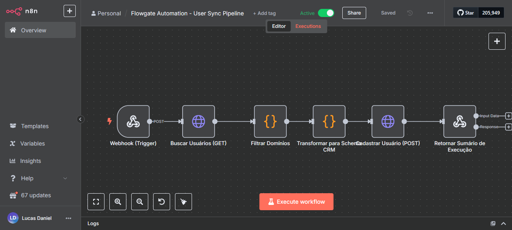
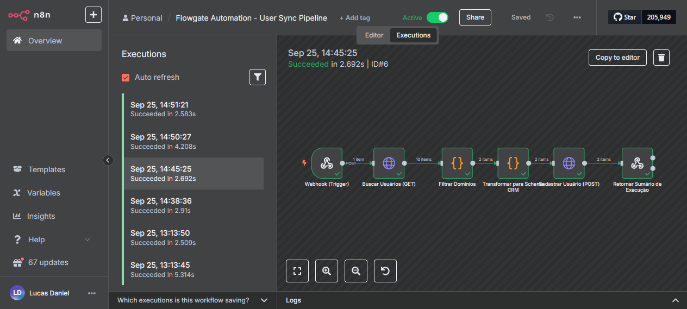
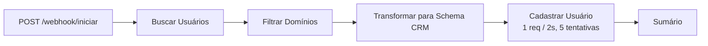

# Flowgate Automation

Pipeline ETL conteinerizado que sincroniza usuários de uma API externa para um
webhook de destino. Orquestrado pelo n8n 1.94.1 em Docker Compose, com batching,
retry e tolerância a falhas parciais.

[](https://github.com/lucasdaniel2201/flowgate-automation/actions/workflows/ci.yml)
[](LICENSE)

O pipeline roda de ponta a ponta sem nenhuma credencial: por padrão ele aponta
para APIs públicas de teste (`jsonplaceholder.typicode.com`), então um
`docker compose up` já tem o que executar.

**Sumário**

- [Para quem quer só rodar](#para-quem-quer-só-rodar)
- [Telas](#telas)
- [Para quem vai mexer no código](#para-quem-vai-mexer-no-código)
- [O que o pipeline faz](#o-que-o-pipeline-faz)
- [Regras da carga](#regras-da-carga)
- [Testes](#testes)
- [Arquitetura](#arquitetura)
- [Observabilidade](#observabilidade)
- [CI](#ci)
- [Status](#status)
- [Limitações conhecidas](#limitações-conhecidas)
- [Estrutura do projeto](#estrutura-do-projeto)
- [Controle de versão](#controle-de-versão)
- [Licença](#licença)

## Para quem quer só rodar

Precisa apenas do Docker (v26+) e, para os atalhos do `Makefile`, de um shell
POSIX. Não há nada para instalar além disso.

```bash
git clone https://github.com/lucasdaniel2201/flowgate-automation.git
cd flowgate-automation

cp .env.example .env      # os padrões já funcionam
make up                   # sobe o n8n e espera o healthcheck
make n8n-import           # importa e ativa o workflow
```

O editor fica em **http://localhost:5678**. Sem `make`, os mesmos passos são:

```bash
docker compose up -d
bash scripts/import-workflow.sh
```

Na primeira visita o n8n pede para você criar a conta de dono da instância —
não existe basic auth aqui, e o `.env.example` explica por quê.

Para disparar o pipeline:

```bash
curl -X POST http://localhost:5678/webhook/iniciar
```

```json
{
  "executionTime": "2026-09-25T15:44:59.810Z",
  "message": "Workflow executado com sucesso",
  "totalItemsProcessed": 2,
  "correlationId": "4"
}
```

O `correlationId` é o id da execução no n8n: com ele você acha a execução exata
no editor e confere nó por nó o que aconteceu.

O `docker-compose.override.yml` é aplicado sozinho: limites de recurso mais
baixos, log em `debug` e a porta do debugger do Node presa no localhost.

## Telas

| Editor do workflow | Execuções |
| ------------------ | --------- |
| [](docs/screenshots/workflow.png) | [](docs/screenshots/executions.png) |

Capturas de uma instância local rodando contra as APIs públicas de teste. Cada
execução leva ~2,5s para 2 usuários, que é o batching de 2s mais a latência das
requisições.

## Para quem vai mexer no código

Os testes estáticos não precisam de Docker nem de rede:

```bash
node --test "tests/**/*.test.mjs"   # ou: make test
```

Os testes ponta a ponta precisam do n8n no ar e batem na internet (é um E2E de
verdade):

```bash
make up
make smoke-test
```

O workflow é `workflows/workflow_user_sync.json` — todo o pipeline mora nesse
arquivo. Depois de editar, `make n8n-import` importa e ativa; a importação é
idempotente, então rodar dez vezes deixa um workflow só.

> **Ao subir a `typeVersion` de um nó, confira se a imagem fixa suporta.** O
> `tests/workflow.test.mjs` guarda a versão máxima de cada tipo e falha se você
> passar do que o n8n 1.94.1 tem. Declarar uma versão inexistente faz a ativação
> falhar com um erro obscuro (`Cannot read properties of undefined (reading
> 'execute')`) — foi exatamente o que aconteceu aqui.

No Windows, `make` depende de `grep`/`awk` no PATH; nesse caso rode os comandos
de `node --test` e `docker compose` direto, ou os scripts via Git Bash.

## O que o pipeline faz

Seis nós, encadeados sem branches:

| Etapa | Nó | O que faz |
| ----- | -- | --------- |
| 1 | Webhook (Trigger) | Recebe `POST /webhook/iniciar` |
| 2 | Buscar Usuários (GET) | `GET` na API externa, 5 tentativas com 5s entre elas |
| 3 | Filtrar Domínios | Mantém só e-mails `.net` e `.org` |
| 4 | Transformar para Schema CRM | Monta o payload do destino e anexa o `correlationId` |
| 5 | Cadastrar Usuário (POST) | `POST` por usuário, 1 item/2s, 5 tentativas, falha vira aviso |
| 6 | Retornar Sumário de Execução | Devolve o JSON do sumário ao chamador |

O filtro por domínio é regra de negócio de exemplo, não requisito técnico:
troque o `.net`/`.org` no nó 3 pelo seu critério.

## Regras da carga

**Batching.** Um item por batch, 2s entre batches. É proteção contra rate limit
do destino, não uma tentativa de throughput.

**Retry.** Cinco tentativas com 5s entre elas, por item: até ~25s antes de
desistir. Uma falha transitória do destino não perde o registro.

**Falhas parciais não derrubam a execução.** Com `onError:
continueRegularOutput`, um item que esgota as tentativas vira aviso e o pipeline
segue para os próximos. O sumário traz o total processado para você reconciliar
o que ficou de fora.

**Custo real disso:** com o destino respondendo, 2 usuários levam ~2,7s. Com o
destino fora do ar, cada usuário leva ~25s para ser marcado como falho. O
detalhamento está em
[ADR-0002](docs/decisions/0002-estrategia-resiliencia.md).

## Testes

```
node --test "tests/**/*.test.mjs"
```

23 testes, usando só a stdlib do Node (`node:test`), sem rede e sem containers.
Cobrem o workflow JSON (nós obrigatórios, conexões coerentes, `typeVersion`
dentro do que a imagem suporta, expressões com o prefixo `=`), a configuração do
`docker-compose.yml` e a consistência do `.env.example` com o compose.

O `make smoke-test` é outra coisa: sobe do zero, importa o workflow, dispara o
webhook e confere o sumário. Ele é o que garante que o pipeline executa de
verdade — os testes estáticos garantem que ele não regride em silêncio.

O CI roda os dois a cada push.

## Arquitetura

O princípio é simples: **o n8n é o orquestrador, não o lugar da regra de
negócio complicada.** O workflow é um JSON versionado, revisável em pull
request e importável por CLI.


```mermaid
graph LR
    A[POST /webhook/iniciar] --> B[Buscar Usuários]
    B --> C[Filtrar Domínios]
    C --> D[Transformar para Schema CRM]
    D --> E[Cadastrar Usuário<br/>1 req / 2s, 5 tentativas]
    E --> F[Sumário]
```

> **Detalhes completos**: [`docs/architecture.md`](docs/architecture.md)
> **Decisões de design**: [`docs/decisions/`](docs/decisions/)

## Observabilidade

Métricas em `http://localhost:5678/metrics`, logs JSON no stdout.

O n8n Community expõe pouca coisa por workflow nesta versão: na prática
`n8n_active_workflow_count` e a saúde do processo Node (`n8n_process_*`,
`n8n_nodejs_*`). Contadores de execução por workflow **não** existem — para
acompanhar execuções, use a lista no editor ou o `correlationId` devolvido pelo
webhook.

> **Guia completo, com as métricas que existem de fato**:
> [`docs/observability.md`](docs/observability.md)

## CI

Dois jobs, a cada push e pull request para `main`:

1. **Testes estáticos** — `node --test "tests/**/*.test.mjs"`
2. **Smoke test ponta a ponta** — sobe o compose, espera o healthcheck, importa
   o workflow, ativa e dispara o webhook, conferindo o sumário

O estado atual está no badge no topo.

## Status

**Pronto:** pipeline de 6 nós com retry, batching e tolerância a falhas
parciais; Docker Compose com healthcheck, limites de recursos e rede isolada;
importação idempotente do workflow por CLI, com ativação; suíte de 23 testes
estáticos; smoke test ponta a ponta; CI rodando os dois.

**Fora do escopo, por decisão de projeto:**

- **Escala horizontal e alta disponibilidade.** O n8n Community não roda em modo
  fila sem licença. O desenho aqui é uma instância só, com volume persistente.
- **Fila no lugar do batching.** Para o volume alvo (dezenas a centenas de
  registros por execução), Redis ou RabbitMQ seriam mais uma peça para manter de
  pé sem ganho correspondente.
- **Gerenciador de secrets.** Faz sentido em produção com Vault ou Secrets
  Manager; aqui só somaria dependência.

## Limitações conhecidas

- **O webhook não é autenticado.** Quem alcança a porta dispara o pipeline. O
  item está no [roadmap](docs/roadmap.md).
- **Não há TLS.** A instância é de desenvolvimento; não exponha a 5678 na
  internet sem um reverse proxy com HTTPS.
- **Sem DLQ.** Um item que esgota as cinco tentativas não é reprocessado
  automaticamente. Rodar de novo reprocessa tudo — se o destino não for
  idempotente, pode duplicar o que já foi gravado.
- **O n8n Community não expõe métricas por execução** nesta versão, o que
  limita o que dá para alertar (veja
  [`docs/observability.md`](docs/observability.md)).
- **O smoke test depende de rede externa**, porque o destino padrão é uma API
  pública. É um E2E de verdade, e por isso não roda offline.

## Estrutura do projeto

| Caminho | Função |
| ------- | ------ |
| `workflows/workflow_user_sync.json` | O pipeline. É este arquivo que o n8n executa. |
| `docker-compose.yml` | Infraestrutura: imagem fixa, healthcheck, limites, rede isolada, volume nomeado. |
| `docker-compose.override.yml` | Ajustes de desenvolvimento, aplicados automaticamente pelo Compose. |
| `scripts/import-workflow.sh` | Copia o JSON para o container, importa, ativa e espera o webhook responder. |
| `scripts/smoke-test.sh` | Teste ponta a ponta: infraestrutura, importação e uma execução real. |
| `tests/` | Testes estáticos (`node:test`), sem rede e sem containers. |
| `Makefile` | Atalhos: `up`, `down`, `logs`, `shell`, `n8n-import`, `test`, `smoke-test`. |
| `start.sh` | Sobe o n8n sem depender do `make`. |
| `.env.example` | Template de configuração, com os padrões já funcionais. |
| `.gitattributes` | Força LF nos scripts e no Makefile, mesmo em checkout no Windows. |
| `docs/` | Arquitetura, observabilidade, roadmap e ADRs. |
| `CHANGELOG.md` | Histórico por versão. |
| `SECURITY.md` | Política de segurança e o que **não** está protegido. |

## Controle de versão

O projeto está sob git. O `.gitignore` exclui `.env` (e variantes), arquivos de
IDE e lixo de sistema operacional. Nenhuma credencial é versionada: o
`.env.example` só tem valores públicos, e nenhum deles é secret.

## Licença

MIT — veja [LICENSE](LICENSE).

## Autor

**Lucas Daniel Santos** — Analista de Implantação | Infraestrutura e Automação

- GitHub: [@lucasdaniel2201](https://github.com/lucasdaniel2201)
- LinkedIn: [lucas-santos](https://www.linkedin.com/in/lucas-santos-a620011b9)
