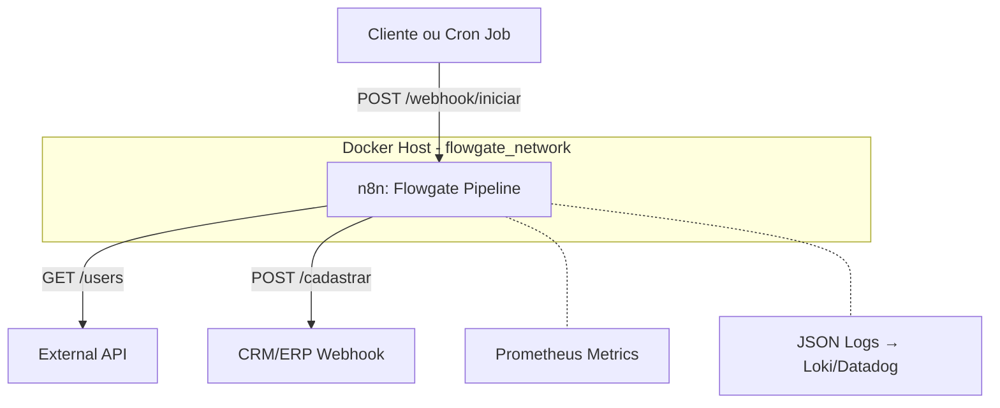
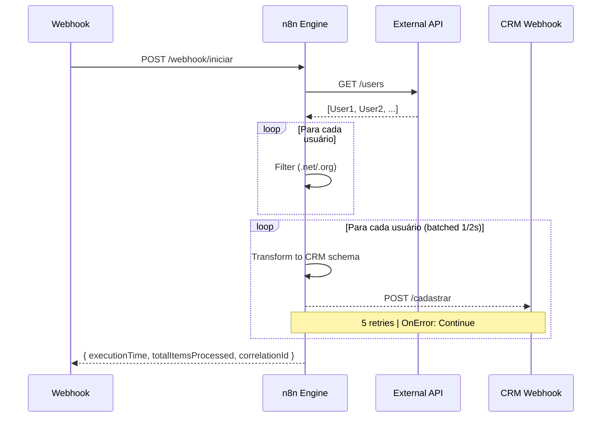

# Arquitetura de Referência

> Status: Draft
> Versão: 1.0

## Visão Geral (C4 - Nível 1 — Contexto)



## Fluxo do Pipeline (Nível 2 — Workflow)



## Decisões de Arquitetura

Ver `docs/decisions/` para os ADRs detalhados:

1. **Por que n8n e não Airflow/Temporal?** — Zero-dependências, low-code
   para MVP, mas migrável para Temporal quando > 100k execuções/dia.
2. **Por que batching client-side e não message queue?** — Simplicidade
   operacional. Sem dependência de Redis/RabbitMQ no MVP.
3. **Por que TypeScript e não JavaScript vanilla?** — Tipagem forte
   previne bugs de runtime e serve como documentação viva.

## Estrutura de Diretórios

```
flowgate-automation/
├── src/
│   ├── core/
│   │   ├── domain/          # Interfaces e tipos (Order, PricingRule, ProcessedOrder)
│   │   ├── services/        # Lógica de negócio (OrderProcessor, OrderValidator)
│   │   ├── errors/          # Hierarquia de erros do domínio
│   │   └── utils/           # Logger estruturado, helpers
│   ├── cli/                 # Entrypoint CLI
│   ├── __tests__/           # Testes unitários + fixtures
│   └── index.ts             # Barrel export
├── workflows/               # Workflow n8n (importável)
├── docs/                     # Documentação estendida
│   ├── architecture.md      # Este documento
│   ├── decisions/           # Architecture Decision Records
│   └── observability.md     # Guia de métricas e dashboards
├── .github/
│   ├── workflows/           # CI/CD pipelines
│   ├── ISSUE_TEMPLATE/      # Templates de issue
│   └── dependabot.yml       # Atualização de dependências
├── docker-compose.yml       # IaC principal
├── docker-compose.override.yml  # Overrides de desenvolvimento
├── Dockerfile               # Multi-stage build
├── Makefile                 # Atalhos do desenvolvedor
└── README.md                # Documentação principal
```

## Stack Tecnológica

| Camada            | Tecnologia                             | Justificativa                        |
| ----------------- | -------------------------------------- | ------------------------------------ |
| Orquestração      | n8n 1.94.1                             | Low-code com resiliência nativa      |
| Containerização   | Docker + Docker Compose                | Portabilidade e IaC                  |
| Linguagem         | TypeScript 5.x (strict mode)           | Tipo como documentação fôrça         |
| Validação runtime | Zod                                    | Defesa em profundidade além de TS    |
| Logging           | Pino                                   | JSON estruturado, redação de secrets |
| Testes            | Vitest + Testcontainers                | Cobertura > 90% com threshold        |
| Qualidade         | ESLint + Prettier + Husky + Commitlint | Code quality gate automático         |
| CI/CD             | GitHub Actions                         | Quality gate + build em ~30s         |
| Observabilidade   | Prometheus metrics endpoint            | `http://localhost:5678/metrics`      |
