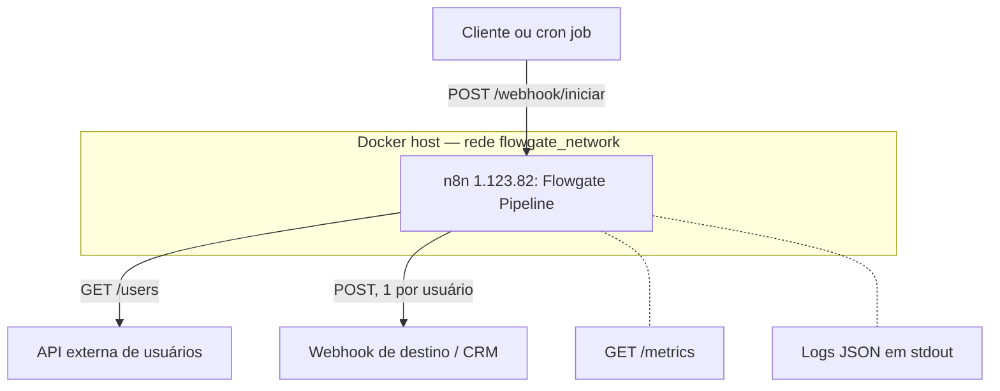
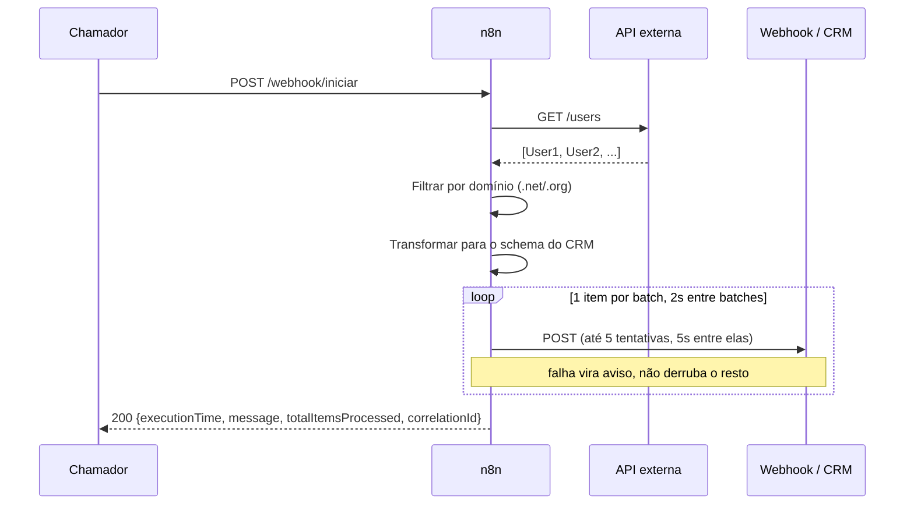

# Arquitetura

> Última atualização: 2026-09-28

## Visão geral (C4 — nível 1, contexto)


```mermaid
graph TB
    Client[Cliente ou cron job] -->|POST /webhook/iniciar| Flowgate
    Flowgate[n8n 1.123.82: Flowgate Pipeline] -->|GET /users| ExtAPI[API externa de usuários]
    Flowgate -->|POST, 1 por usuário| CRM[Webhook de destino / CRM]
    Flowgate -.- Metrics[GET /metrics]
    Flowgate -.- Logs[Logs JSON em stdout]

    subgraph Docker[Docker host — rede flowgate_network]
        Flowgate
    end
```

## Fluxo do pipeline (C4 — nível 2)


```mermaid
sequenceDiagram
    participant Caller as Chamador
    participant n8n as n8n
    participant API as API externa
    participant CRM as Webhook / CRM

    Caller->>n8n: POST /webhook/iniciar
    n8n->>API: GET /users
    API-->>n8n: [User1, User2, ...]

    n8n->>n8n: Filtrar por domínio (.net/.org)
    n8n->>n8n: Transformar para o schema do CRM

    loop 1 item por batch, 2s entre batches
        n8n->>CRM: POST (até 5 tentativas, 5s entre elas)
        note over n8n,CRM: falha vira aviso, não derruba o resto
    end

    n8n-->>Caller: 200 {executionTime, message, totalItemsProcessed, correlationId}
```

## Os 6 nós

| Etapa | Nó | Tipo | Resiliência |
| ----- | -- | ---- | ----------- |
| 1 | Webhook (Trigger) | `webhook` | `POST /webhook/iniciar`, resposta pelo nó 6 |
| 2 | Buscar Usuários (GET) | `httpRequest` | 5 tentativas, 5s entre elas |
| 3 | Filtrar Domínios | `code` | Lógica pura, sem I/O |
| 4 | Transformar para Schema CRM | `code` | Executa por item, anexa o `correlationId` |
| 5 | Cadastrar Usuário (POST) | `httpRequest` | 5 tentativas, batching 1 item/2s, `onError: continue` |
| 6 | Retornar Sumário de Execução | `respondToWebhook` | Devolve o JSON do sumário |

O encadeamento é linear, sem branches: cada nó alimenta exatamente o próximo.
A validação disso está em `tests/workflow.test.mjs`.

### Detalhes que importam

- **O webhook declara `httpMethod: POST` explicitamente.** O padrão do nó é
  `GET`; sem essa chave, a URL documentada responde 404.
- **As URLs são expressões de verdade**, com o prefixo `=`. Sem ele o n8n trata
  `{{ $env.CRM_WEBHOOK_URL }}` como texto literal e a requisição falha com
  `Invalid URL`.
- **O `correlationId` é o id da execução**, não um UUID por item. Um UUID por
  item daria dez correlações diferentes para a mesma execução — o oposto de
  correlacionar.
- **O filtro é por domínio de e-mail** (`.net` e `.org`), feito no nó 3. É regra
  de negócio de exemplo, não requisito técnico: troque à vontade.

## Idempotência da importação

`n8n import:workflow` cria um workflow novo a cada chamada quando o JSON não
tem `id`. Por isso o `workflows/workflow_user_sync.json` carrega
`"id": "flowgate-user-sync"`, que faz a importação sobrescrever o mesmo
workflow em vez de acumular cópias. Rodar `make n8n-import` dez vezes continua
deixando um workflow só.

A ativação é um passo separado porque o CLI do n8n escreve a flag no banco, mas
só registra os webhooks no boot seguinte: `scripts/import-workflow.sh` importa,
ativa e reinicia o container, esperando o webhook responder antes de retornar.

## Decisões de arquitetura

Os ADRs ficam em `docs/decisions/`:

1. [Por que n8n e não Airflow ou Temporal?](decisions/0001-por-que-n8n.md)
2. [Estratégia de resiliência: retries, batching e falhas parciais](decisions/0002-estrategia-resiliencia.md)

## Estrutura de diretórios

```
flowgate-automation/
├── .github/
│   ├── workflows/ci.yml         # testes estáticos + smoke test ponta a ponta
│   ├── ISSUE_TEMPLATE/
│   ├── PULL_REQUEST_TEMPLATE.md
│   └── dependabot.yml           # atualiza Docker e Actions
├── docs/
│   ├── architecture.md          # este documento
│   ├── observability.md         # métricas e logs
│   ├── roadmap.md
│   ├── screenshots/             # imagens usadas no README
│   └── decisions/               # ADRs
├── scripts/
│   ├── import-workflow.sh       # importa, ativa e espera o webhook
│   └── smoke-test.sh            # teste ponta a ponta
├── tests/                       # testes estáticos (node:test, sem dependências)
├── workflows/
│   └── workflow_user_sync.json  # o pipeline, versionado
├── docker-compose.yml           # infraestrutura
├── docker-compose.override.yml  # ajustes de desenvolvimento
├── Makefile                     # atalhos
├── start.sh                     # sobe sem depender do make
└── .env.example                 # template de configuração
```

## Stack

| Camada | Tecnologia | Versão |
| ------ | ---------- | ------ |
| Orquestração | n8n | `1.123.82` (fixa) |
| Containerização | Docker + Docker Compose | Compose v2 |
| Scripts | Bash | — |
| Testes | `node:test` (stdlib) | Node 22+ |
| CI | GitHub Actions | — |
| Métricas | Prometheus `/metrics` | — |
